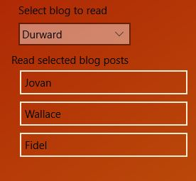

# EfBlogging

A solution with two projects demonstrating several features and adins that I frequently use in application development.

Impetus for creating this project was attempting to implement sqlite in my updating of win8.0 TheLolFx in the store to uwp The implementation I created didn't act as I believed it should

I've used sql and entityframework (ef) a few times. It had been awhile. 
hence my implementing the Blog / Post classes of [this](https://docs.microsoft.com/en-us/ef/core/get-started/uwp/getting-started) article "UWP - New Database" for adding core.sqlite to uwp. 
So I would be working on a know good implementation. In fact the classes are in the wpf project and linked (not coppied) to the uwp project. 
No chance of my fat fingers making a syntax error as I stare at the screen after hours of scratching my head at the seemingly odd behavior of ef SaveChanges()

* [Bogus](https://github.com/bchavez/Bogus) - seeding fake data
* [PropertyChanged.Fody](https://github.com/Fody/PropertyChanged) - implements INotifyPropertyChanged at compile 
* [MvvmLight Toolkit](http://www.mvvmlight.net/)

Also demonstrates an inconsistency between ef sqlite and ef localDb
* EfBlogging.Wpf - ef and LocalDB
* EfBlogging.Uwp - ef and core.sqlite

It works great in the wpf LocalDB implementation, 
however in the uwp solution the **dbContext SaveChanges() doesn't appear to persist the List of posts in the Blogs after the dataContext is released.**
The Blogs and the Posts remain, but not the list of posts in a blog.

Here is an image of the uwp version working. The comboBox ItemsSource bound to bloggingContext.Blogs selects the blog, the ListView ItemsSource is bound to the Selected of the ComboBox displays the posts in that Blog. 

